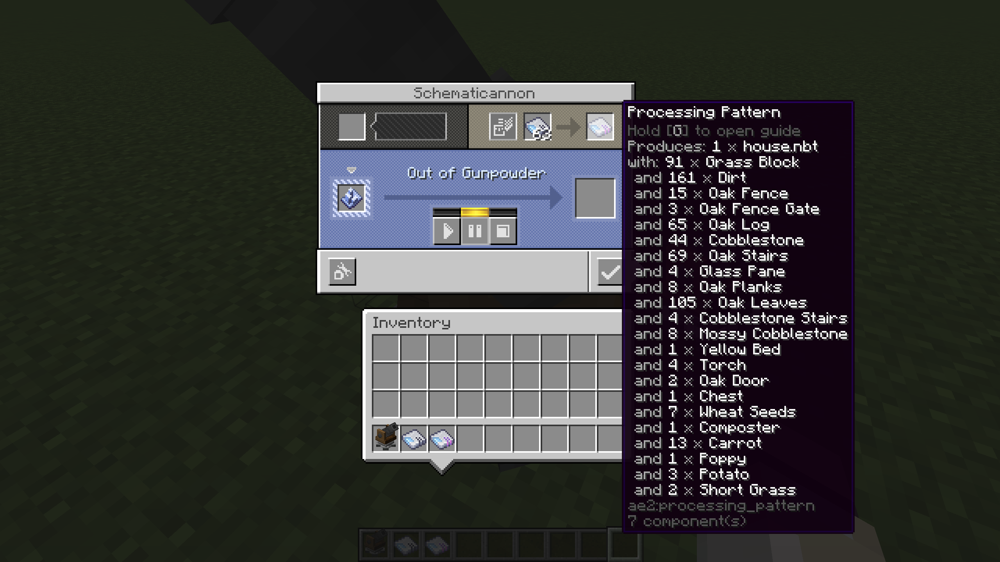

# Schematicanon Processing Pattern

Generate AE2 processing pattern from Create schematicanon.

> [!NOTE]
>
> In versions of AE2 prior to 12.9.0, processing patterns only allowed 18 input slots; later versions allow a maximum of 81 input slots. This means that a blueprint can only contain a maximum of 18 or 81 materials; otherwise, AE2 cannot recognize the processing pattern.

## Dependencies

- **Minecraft:** 1.18.2/1.19.2/1.20.1/1.21.1
- **Mod loader:** Fabric/Forge/NeoForge
- **Create:** 0.5.1+
- **Applied Energistics 2:** any

## Branch information

- **[1.18.2](https://github.com/Myitian/SchematicanonProcessingPattern/tree/1.18.2):** Support Minecraft 1.18.2 Fabric/Forge
- **[1.19.2](https://github.com/Myitian/SchematicanonProcessingPattern/tree/1.19.2):** Support Minecraft 1.19.2 Fabric/Forge
- **[1.20.1](https://github.com/Myitian/SchematicanonProcessingPattern/tree/1.20.1):** Support Minecraft 1.20.1 Fabric/Forge
- **[1.21.1](https://github.com/Myitian/SchematicanonProcessingPattern/tree/1.21.1):** Support Minecraft 1.21.1 NeoForge